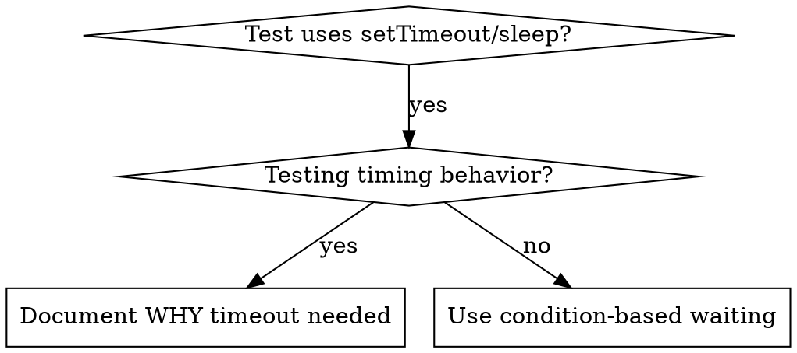

# 基于条件的等待（Condition-Based Waiting）

## 概述

不稳定（flaky）的测试常常用任意设定的延时来“猜”时序。这会制造竞态条件（race condition）：测试在快机器上通过，但在高负载或 CI 中失败。

**核心原则：** 等待你真正关心的那个条件，而不是猜它需要多久。

## 何时使用



**在以下情况使用：**
- 测试中有任意设定的延时（`setTimeout`、`sleep`、`time.sleep()`）
- 测试不稳定（有时通过，高负载下失败）
- 测试在并行运行时超时
- 在等待异步操作完成

**不要在以下情况使用：**
- 在测试真实的时序行为（debounce、throttle 的间隔）
- 如果使用任意设定的超时，务必记录原因（WHY）

## 核心模式

```typescript
// ❌ BEFORE: Guessing at timing
await new Promise(r => setTimeout(r, 50));
const result = getResult();
expect(result).toBeDefined();

// ✅ AFTER: Waiting for condition
await waitFor(() => getResult() !== undefined);
const result = getResult();
expect(result).toBeDefined();
```

## 常用模式

| 场景 | 模式 |
|----------|---------|
| 等待事件 | `waitFor(() => events.find(e => e.type === 'DONE'))` |
| 等待状态 | `waitFor(() => machine.state === 'ready')` |
| 等待计数 | `waitFor(() => items.length >= 5)` |
| 等待文件 | `waitFor(() => fs.existsSync(path))` |
| 复合条件 | `waitFor(() => obj.ready && obj.value > 10)` |

## 实现

通用的轮询函数：
```typescript
async function waitFor<T>(
  condition: () => T | undefined | null | false,
  description: string,
  timeoutMs = 5000
): Promise<T> {
  const startTime = Date.now();

  while (true) {
    const result = condition();
    if (result) return result;

    if (Date.now() - startTime > timeoutMs) {
      throw new Error(`Timeout waiting for ${description} after ${timeoutMs}ms`);
    }

    await new Promise(r => setTimeout(r, 10)); // Poll every 10ms
  }
}
```

完整实现见本目录下的 `condition-based-waiting-example.ts`，其中包含来自真实调试会话的、领域特定的辅助函数（`waitForEvent`、`waitForEventCount`、`waitForEventMatch`）。

## 常见错误

**❌ 轮询过快：** `setTimeout(check, 1)` —— 浪费 CPU
**✅ 修复：** 每 10ms 轮询一次

**❌ 没有超时：** 条件永不满足时会无限循环
**✅ 修复：** 始终包含超时，并给出清晰的错误信息

**❌ 数据过期：** 在循环之前缓存了状态
**✅ 修复：** 在循环内部调用 getter 以获取最新数据

## 何时使用任意设定的超时是正确的

```typescript
// Tool ticks every 100ms - need 2 ticks to verify partial output
await waitForEvent(manager, 'TOOL_STARTED'); // First: wait for condition
await new Promise(r => setTimeout(r, 200));   // Then: wait for timed behavior
// 200ms = 2 ticks at 100ms intervals - documented and justified
```

**要求：**
1. 先等待触发条件
2. 基于已知的时序（而不是猜）
3. 用注释说明原因（WHY）

## 真实世界的成效

来自调试会话（2025-10-03）：
- 修复了横跨 3 个文件的 15 个不稳定测试
- 通过率：60% → 100%
- 执行时间：快了 40%
- 不再有竞态条件
